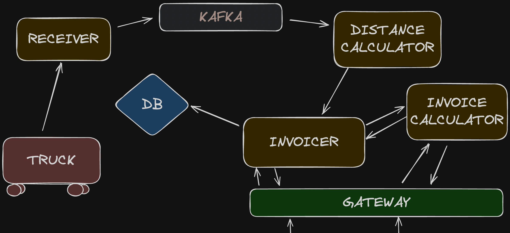

# freight-fare-engine
FreightFareEngine is a Golang microservice project designed to calculate fees for trucks engaged in 
freight transportation. This microservice-based architecture allows for modularity and scalability in managing 
charge calculations.

## Architecture
<p align="center">
  
</p>

## Project Setup
### Environment Variables
```
AGGREGATE_HTTP_ENDPOINT=localhost:4000
AGGREGATE_GRPC_ENDPOINT=localhost:3001
AGGREGATE_STORE_TYPE=memory
GATEWAY_SERVER_ENDPOINT=localhost:6000
```

### How to run?
To build and run the different components of the project, you can use the provided Makefile.
